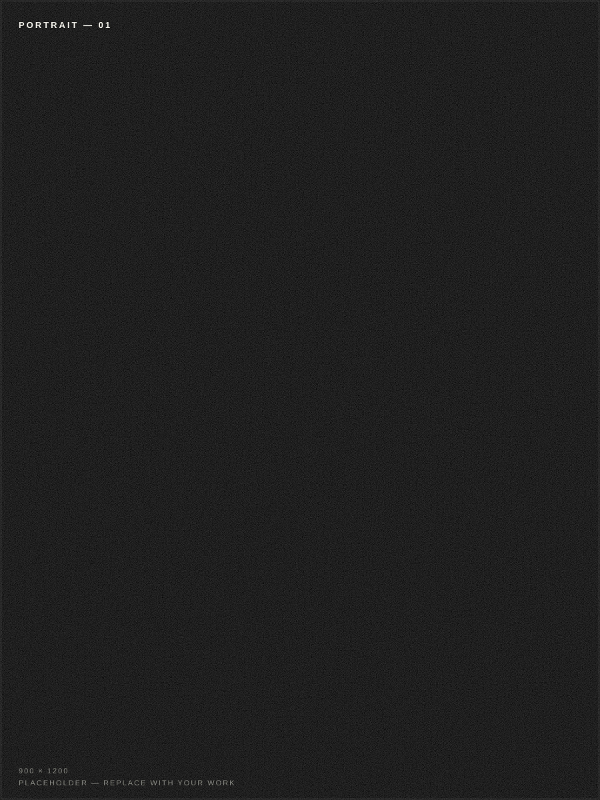

# Portfolio Template

A free, open-source, single-page portfolio with a cinematic loader, GSAP scroll animations and **one file that controls every word on the site** — `src/data.js`. No HTML or JavaScript knowledge needed to make it yours.



## Features

- **Single source of truth** — every headline, paragraph, label and link lives in `src/data.js`. Edit it, save, done.
- Cinematic pre-loader with counter, then a staggered hero intro.
- 16 sections: hero, intro, journey timeline, education, experience, early roles, leadership, creative work, photography gallery, cinematic, pinned horizontal "think. make. tell." strip, skills, certifications, interests accordion, "why work with me", next steps and contact.
- Fullscreen menu, custom cursor (desktop), scroll progress bar, smooth scrolling (Lenis).
- Built with GSAP + ScrollTrigger; fully respects `prefers-reduced-motion`.
- Responsive: desktop, tablet and mobile.
- SEO-ready: title, description, Open Graph and JSON-LD structured data, all driven by `src/data.js`.
- No backend, no database — a static site you can host anywhere.

## Tech stack

- [Vite](https://vite.dev) 7 — build tool
- [GSAP](https://gsap.com) + ScrollTrigger — animations
- [Lenis](https://github.com/darkroomengineering/lenis) — smooth scrolling
- Vanilla ES modules — no framework

## Quick start

Requires [Node.js](https://nodejs.org) 18+ and npm.

```bash
npm install
npm run dev      # start the dev server (usually http://localhost:5173)
```

To build for production:

```bash
npm run build
npm run preview  # preview the production build
```

## Make it yours — edit `src/data.js`

This is the only file you need to touch for content. Open it and:

1. **CORE IDENTITY** — replace `FULL_NAME`, `BRAND`, `ROLE`, `LOCATION`, `EMAIL`, etc. These values are reused across the whole site automatically.
2. Work down through each section and replace the sample text. Each section is clearly labelled with a comment.
3. Values marked `[ADD ...]` are not set yet — replace them with your real links. Until then they render greyed-out and are not clickable, so it's safe to leave them.
4. The hero statement supports `<em>word</em>` — those words render in serif italic (the last one in accent color).

> **Tip:** every section in `index.html` has a comment above it (e.g. `<!-- ── EXPERIENCE ── -->`). If you don't want a section, delete that whole `<section>` block — no code changes needed.

## Adding your own images

Drop your photos into `public/photos/` and point the `src` fields in `src/data.js` at them (e.g. `intro.portrait.src`). Files named exactly like the bundled placeholders swap in automatically.

The bundled SVGs in `public/photos/` are clearly-marked placeholders — regenerate them any time with:

```bash
npm run gen:photos
```

## Project structure

```
├── index.html            # layout skeleton (copy bound from data.js)
├── src/
│   ├── data.js           # ⭐ ALL CONTENT — edit this file
│   ├── main.js           # boot sequence, SEO, smooth scroll
│   ├── js/
│   │   ├── render.js     # fills the page from data.js
│   │   ├── animations.js # GSAP scroll animations
│   │   ├── loader.js     # cinematic pre-loader
│   │   ├── menu.js       # fullscreen menu
│   │   ├── cursor.js     # custom cursor (desktop)
│   │   └── split.js      # text splitter for masked reveals
│   └── styles/           # base, components, sections, responsive
├── public/photos/        # placeholder images — replace with yours
└── scripts/              # dev tooling (verify, audit, placeholder generator)
```

## Verification tooling

Start the preview server, then run the checks:

```bash
npm run preview
npm run verify   # loads the site, screenshots every section, checks console errors
npm run audit    # programmatic layout/behavior checks at 3 viewports
```

Both scripts auto-detect Chrome or Edge. To force a specific browser:

```bash
# PowerShell
$env:CHROME_PATH = "C:\path\to\chrome.exe"

# macOS / Linux
CHROME_PATH=/path/to/chrome npm run verify
```

## Deploying

`npm run build` outputs a static site into `dist/` — upload it to any static host:

- **Netlify / Vercel** — connect the repo, build command `npm run build`, output `dist`.
- **GitHub Pages** — if you publish under a project path, change `base` in `vite.config.js` (e.g. `base: "/my-repo/"`).

## Credits

Built with GSAP, Lenis and Vite. Fonts: [Space Grotesk](https://fonts.google.com/specimen/Space+Grotesk) and [Instrument Serif](https://fonts.google.com/specimen/Instrument+Serif).

## License

[MIT](./LICENSE) — use it, modify it, ship it.
